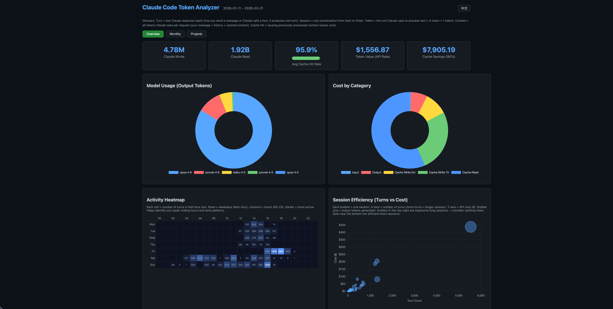
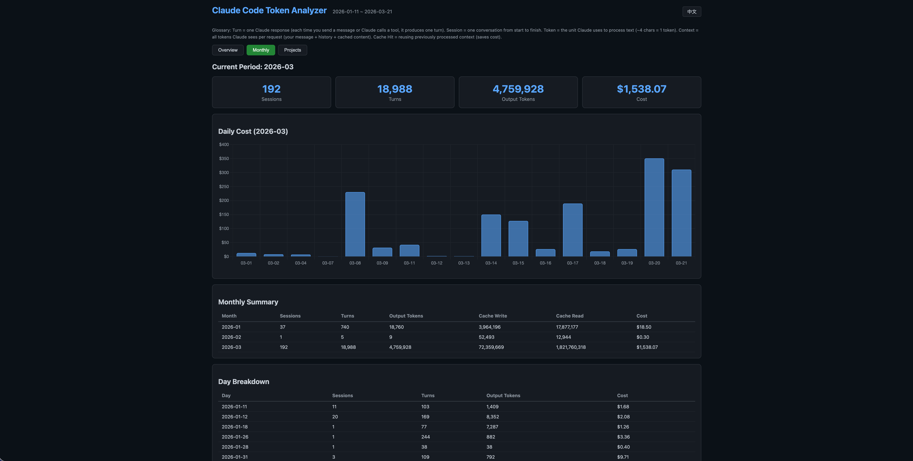
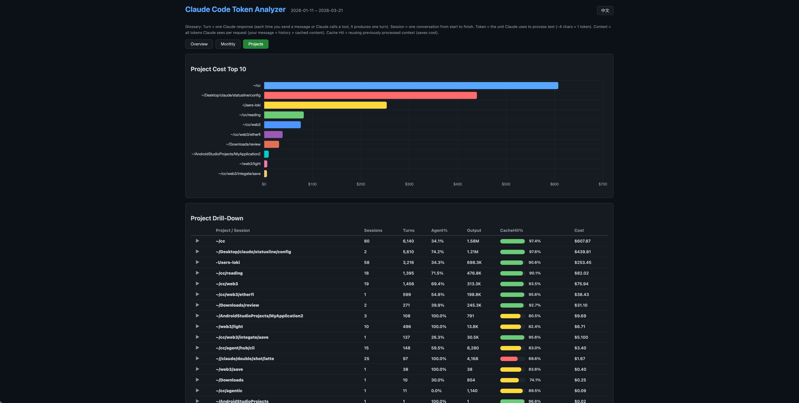

# cc-token-usage

[](https://github.com/LokiQ0713/cc-token-usage/actions/workflows/release.yml)
[](https://www.npmjs.com/package/cc-token-usage)
[](LICENSE)

**想知道 Claude 到底吃掉了你多少 token？** 这个工具直接分析本地 Claude Code 的 session 数据，告诉你每一个 token 的去向 —— 不调 API，不联网，纯本地分析。

[English](README.md)



## 你能看到什么

- **全局概览** — 会话数、轮次、读写 token、缓存节省、API 等效费用
- **项目钻取** — 哪个项目最烧 token？点开看会话，再点开看每一轮对话内容
- **月度趋势** — 每日费用柱状图、按月汇总对比
- **缓存分析** — 90% 的"读取"因为缓存而免费，我们告诉你这省了多少钱
- **消息预览** — 逐轮查看你问了什么、Claude 回了什么

### 月度趋势


### 项目钻取


## 安装

npx 一行搞定（不需要 Rust）：

```bash
npx cc-token-usage
```

通过 cargo 安装：

```bash
cargo install cc-token-usage
```

从源码编译：

```bash
git clone https://github.com/LokiQ0713/cc-token-usage.git
cd cc-token-usage
cargo install --path .
```

## 使用

直接跑 —— 终端输出汇总，自动生成 HTML 仪表盘并打开浏览器：

```bash
cc-token-usage
```

只生成 HTML 仪表盘：

```bash
cc-token-usage --format html
```

按费用排名所有项目：

```bash
cc-token-usage project --top 0
```

最近一次会话详情：

```bash
cc-token-usage session --latest
```

按月汇总：

```bash
cc-token-usage trend --group-by month
```

按天趋势（最近 30 天）：

```bash
cc-token-usage trend --days 30
```

### 示例输出

```
Claude Code Token Report
2026-01-11 ~ 2026-03-21

  238 conversations, 19,720 rounds of back-and-forth

  Claude read  1,913,274,753 tokens
  Claude wrote 4,776,580 tokens

  Cache saved you $7,884.80 (90% of reads were free)
  All that would cost $1,554.50 at API rates

  Model                      Wrote        Rounds     Cost
  ---------------------------------------------------------
  opus-4-6                   4,005,415    15,219 $1,435.47
  sonnet-4-6                   479,336     1,533    $73.22
  haiku-4-5                    254,469     2,322    $19.26

  Top Projects                              Sessions   Turns    Cost
  -------------------------------------------------------------------
  ~/cc                                        80    6134   $606.15
  ~/Desktop/claude/statusline/config           2    5603   $439.16
```

## 工作原理

直接读取 `~/.claude/projects/` 目录。解析所有 JSONL session 文件，包括子 agent 文件（新旧两种格式都支持）。自动校验数据、去重、归属孤立 agent、检测上下文压缩（compaction）。

**定价数据：** 使用 [Anthropic 官方费率](https://platform.claude.com/docs/en/about-claude/pricing)。区分 5 分钟和 1 小时缓存 TTL，精确计算费用。

## 配置

可选。创建 `~/.config/cc-token-usage/config.toml`：

```toml
[[subscription]]
start_date = "2026-01-01"
monthly_price_usd = 200.0
plan = "max_20x"
```

## 技术栈

Rust (serde, clap, chrono, comfy-table) + Chart.js

## 许可证

MIT
